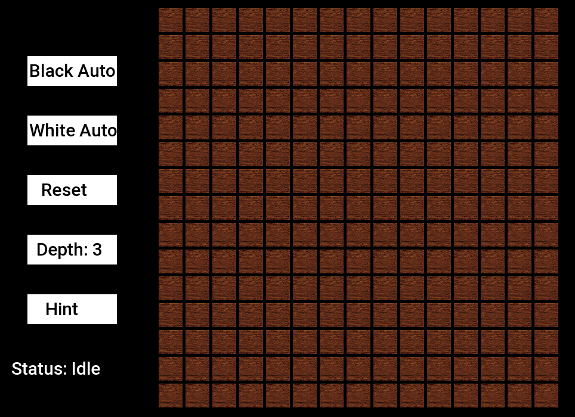
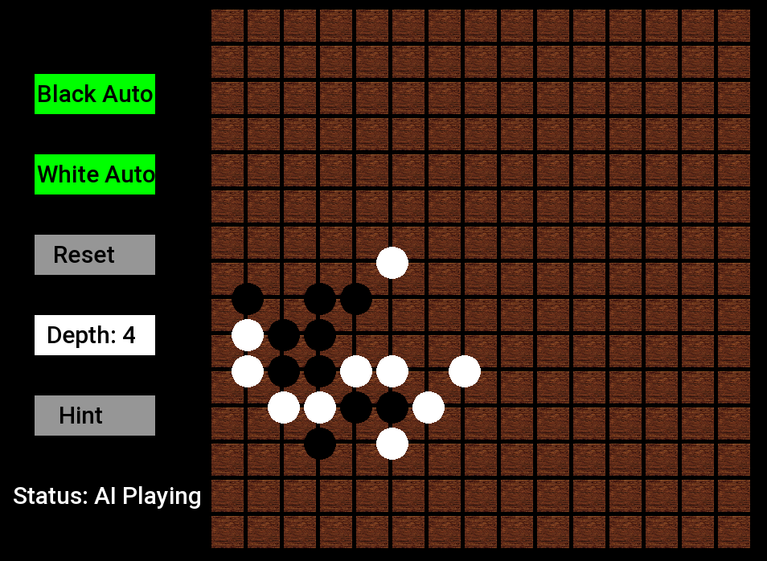
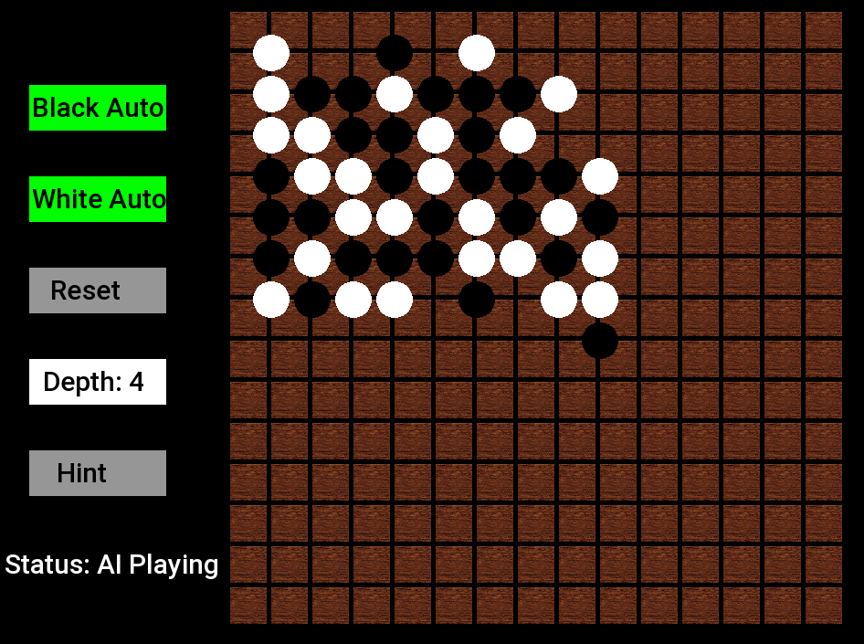
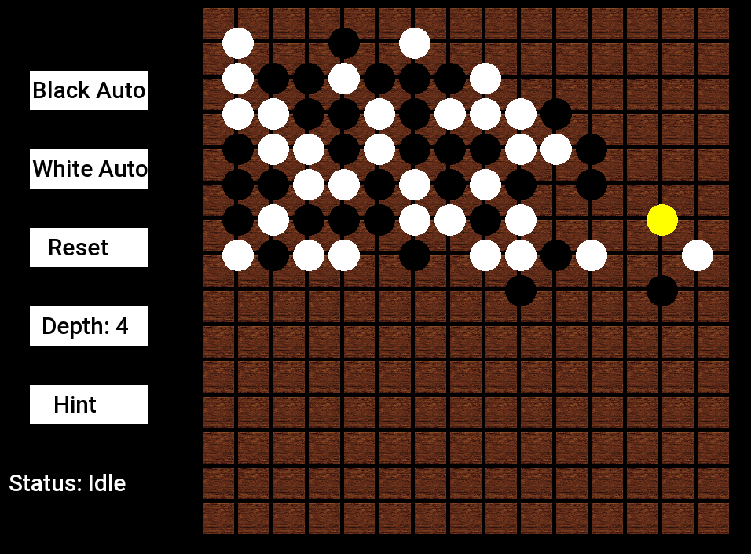
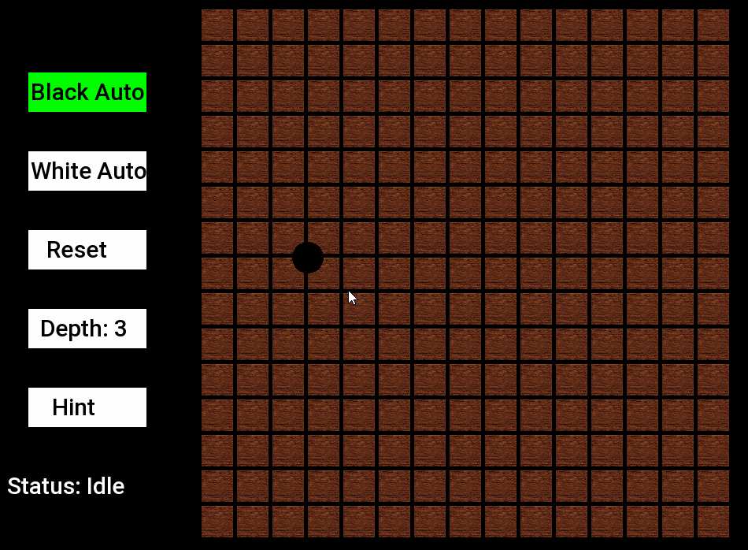

# Gomoku
Gomoku(five-in-a-row or omok(오목)) is a 2-player board game where players take turns placing their stones on the board.    
The objective is to be the first player to make a sequence of five of their stones in a row, horizontally, vertically or diagonally.   

## How to build
You need the following to build this project   

    C++20
    Visual Studio
    SFML library 

Refer to [this page](https://www.sfml-dev.org/tutorials/2.6/start-vc.php) to understand how to set up the SFML library.    

## How to play

Unzip the latest release file and run the excutable in it.
 
```Black Auto Button``` : Let the AI play as the black player    
```White Auto Button``` : Let the AI play as the white player     
```Reset Button``` : Reset the game      
```Depth Button``` : Change the depth at which the minimax algorithm starts      
```Hint Button``` : Receive a recommended move highlighted in yellow   

## Images








